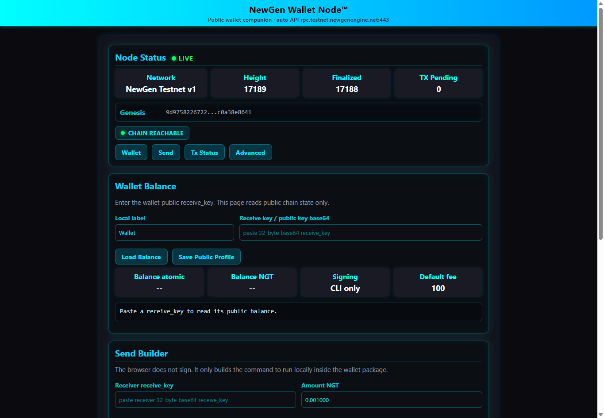

# 001 — L1 Runtime Progress

## Overview

This note collects public runtime evidence from recent NewGen L1 validation work.

The objective is simple: document observable behavior from a real validation run and show that NewGen L1 is progressing as a coherent distributed system under continuous operation.

The evidence below focuses on:

* multi-node convergence
* finalized state progression
* client package startup
* wallet connectivity to live chain state
* peer-delivered block processing
* snapshot activity during runtime

All screenshots were captured during validation against the current NewGen test infrastructure.

---

## Runtime Validation Evidence

### Multi-Node Runtime Validation

The following capture shows three independent NewGen L1 node APIs reporting aligned chain state.

Observed values include:

* identical network identifier
* matching chain height
* matching finalized height
* matching last block hash
* matching finalized hash
* empty mempool state at the time of capture



This is one of the core properties NewGen L1 is designed to preserve: independent nodes converging on the same view of chain state and finality.

---

### NewGen Client Suite Startup

The NewGen Client Suite was started in wallet mode and configured to use the public RPC endpoint.

The package initialized successfully and launched its local HTTP interface.


The goal of the Client Suite is to provide a simple entry point for interacting with the network without requiring users to manually configure multiple runtime components.

---

### Wallet Node Live Runtime Page

The Wallet Node interface connected successfully to the network and retrieved live chain state.

Visible information includes:

* network identity
* chain reachability
* current height
* finalized height
* genesis fingerprint
* pending transaction status


The browser interface reads public chain state only. Transaction signing is performed outside the browser through the wallet package.

---

## Earlier Runtime Excerpt

The following sanitized excerpt was collected during an earlier NewGen L1 validation run.

Peer identifiers and block hashes have been shortened while preserving the runtime behavior being demonstrated.

```
ts=1777931850947 level=INFO node=A target=snapshot.export event=snapshot_export_summary node=A bundle_count=1 bundles=checkpoint-latest@height=461,window_from=0,chunks=8,reachable_only=true
ts=1777931879451 level=INFO node=A target=snapshot.export event=snapshot_export_summary node=A bundle_count=1 bundles=bootstrap-latest@height=461,window_from=0,chunks=8,reachable_only=true

ts=1777931880477 level=INFO node=A target=p2p.chain event=newblock_extends_tip height=462
ts=1777931880478 level=INFO node=A target=eco.ctrl event=fill_estimation_source height=462 source=user_tx_primary fill_ppm=0 ema_fill_ppm=0 mempool_before=0 mempool_after=0 eligible_before=0 eligible_after=0 selected_txs=0 recent_admitted=0 recent_fee_low_rejected=0 recent_fee_low_pruned=0 recent_ingress=0 stale_backlog_hold=false pressure_mempool_len=0
ts=1777931880483 level=INFO node=A target=p2p.chain event=new_block_intake state=applied block_hash=01fc1f93...85558d53 block_height=462 prev_hash=5b0bb735...d6bcc13 sender_peer=12D3KooW...ERjKRn local_height=462 disposition=applied reason_code=tip_extend boot_phase=steady_state sync_state=idle

ts=1777931910472 level=INFO node=A target=p2p.chain event=newblock_extends_tip height=463
ts=1777931910473 level=INFO node=A target=eco.ctrl event=fill_estimation_source height=463 source=user_tx_primary fill_ppm=0 ema_fill_ppm=0 mempool_before=0 mempool_after=0 eligible_before=0 eligible_after=0 selected_txs=0 recent_admitted=0 recent_fee_low_rejected=0 recent_fee_low_pruned=0 recent_ingress=0 stale_backlog_hold=false pressure_mempool_len=0
ts=1777931910478 level=INFO node=A target=p2p.chain event=new_block_intake state=applied block_hash=74a7e623...67158ac0b4 block_height=463 prev_hash=01fc1f93...85558d53 sender_peer=12D3KooW...ERjKRn local_height=463 disposition=applied reason_code=tip_extend boot_phase=steady_state sync_state=idle

ts=1777931940017 level=INFO node=A target=eco.ctrl event=fill_estimation_source height=464 source=user_tx_primary fill_ppm=0 ema_fill_ppm=0 mempool_before=0 mempool_after=0 eligible_before=0 eligible_after=0 selected_txs=0 recent_admitted=0 recent_fee_low_rejected=0 recent_fee_low_pruned=0 recent_ingress=0 stale_backlog_hold=false pressure_mempool_len=0
ts=1777931941229 level=INFO node=A target=snapshot.export event=snapshot_export_summary node=A bundle_count=2 bundles=bootstrap-latest@height=464,window_from=0,chunks=8,reachable_only=true;checkpoint-latest@height=464,window_from=0,chunks=8,reachable_only=true
```

## Current Observations

Based on the validation evidence collected so far:

* node APIs are reporting convergent runtime state
* finalized height continues advancing normally
* matching hashes are observed across participating nodes
* peer-delivered blocks are being applied successfully
* snapshot export activity is occurring during runtime
* the Client Suite can connect to the public RPC endpoint
* the Wallet Node interface can read live chain state

During the current validation window, NewGen L1 has progressed through thousands of blocks while continuing to expose consistent finalized state across the observed nodes.

Validation is still ongoing, but the current results are encouraging and continue to support the direction of the NewGen L1 architecture.

---

## Notes

This evidence is intentionally partial.

Private infrastructure details, credentials, validator material, wallet material, API tokens, operational runbooks, and other sensitive information are not included.

This document reflects ongoing validation activity. It should not be interpreted as a public mainnet launch announcement, an open validator onboarding notice, or a claim that all runtime validation work is complete.

Additional evidence covering external follower operation, E2 Compute Hub integration, canonical worker projection, compute execution, and evidence finalization will be published separately.
